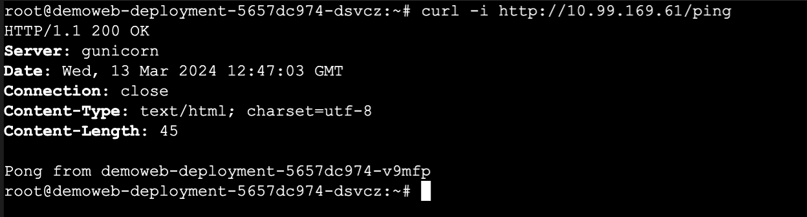
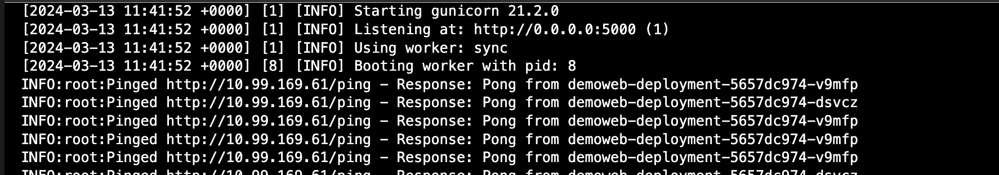
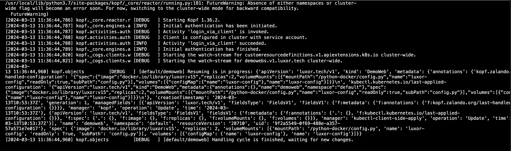

### Luxor Technical Test

## Author: Kurniadi Ilham

Welcome to the Luxor Technical Test repository. This project implements a Kubernetes operator to simulate peering between HTTP servers. The operator watches HTTP server resources defined through a CustomResourceDefinition (CRD) and manages the deployment and communication between these servers.

Prerequisites
Before you begin, make sure you have the following tools installed on your system, you can refer to the documentation of each tools that needs before:

Python: Ensure that Python is installed on your machine. You can download it from python.org.
Minikube: Minikube is a tool that enables you to run Kubernetes clusters locally. Install Minikube by following the instructions at minikube.sigs.k8s.io/docs/start/.
Docker: Docker is used for containerization. Download and install Docker from docker.com.
Kopf: Kubernetes Operator Framework, Installation guide please follow this link, https://kopf.readthedocs.io/en/stable/.


### Section 1: Building http-server source code

We need will build the source code that located in src folder with command,

Working directory: src

```console 
docker build -t luxor-httpserver:v1 .
```

Its because i want to store the image in local, i choose the way to export the image to tar.

```console 
docker image save -o image.tar luxor-httpserver:v1
```

Ater that we need to load the image to minikube, so the image can be load.

```console 
minikube image load image.tar
```

When we successfuly upload the image to minikube, it will show in the list

```console 
minikube image ls
```

### Section 2: Building image for operator 

Working directory: kubernetes/operator

We will build the image for operator that will be used for observe our CRD.

```console 
docker build -t luxor-operator:v1 .
```

we will also doing the export for the docker images and will also load the docker image to minikube with this command,

```console 
docker image save -o image-operator.tar luxor-operator:v1
minikube image load image-operator.tar
```

### Section 3: Deploying the CRD, Kubernetes Operator and also CustomResource.

After everything that we need already loaded to minikube, we will continue with deploying the required things,

## CRD

```console 
kubectl apply -f kubernetes/operator/crd/CustomResourceDefinition.yml
```

## Deploy Operator Permission using RBAC

```console 
kubectl apply -f kubernetes/operator/deploy/rbac
```

## Deploy The Operator

```console 
kubectl apply -f kubernetes/operator/deploy/KubernetesOperator.yml
```

## Deploy CR (demoweb object)

```console 
kubectl apply -f kubernetes/operator/deploy/CustomResource.yml
```

## Check The Operator & The Deployment

```console 
kubectl get pod,svc -n default
```

### Section 4 :  Testing the Resource Deployment

Once all required resources are deployed, validate the behavior of the HTTP servers and the operator:

Check the logs in the deployment of the HTTP server to ensure it serves GET /ping and responds with "pong\n".
Verify that the operator is observing the CRD and managing the deployment of the HTTP servers accordingly.
Confirm that communication between the HTTP servers is functioning by checking the logs for responses from other servers, along with their identifiers.



Multithreading is employed to enable the HTTP server to perform GET requests to other similar HTTP servers, providing a unique identifier obtained from the hostname. The response is as follows:


Pinged http://10.99.169.61/ping - Response: Pong from demoweb-deployment-5657dc974-dsvcz

The provided setup offers visibility for observing the CRD. With this configuration, it's easy to detect changes in the CRD, such as increasing or decreasing the replicaset. Monitoring the operator's log provides insight into its actions and ensures proper management of the HTTP server deployment.



### Section 5 : Comments and Further Improvements

# I want to extend my apologies for being relatively new to working with CRDs, as my previous experience was mainly with the standard Kubernetes API. Additionally, I regret any shortcomings that may have arisen due to time constraints. Given more time, I am confident that I could complete this challenge in a more thorough and effective manner.

# As for further improvements, there are several areas that could be enhanced. Firstly, we could make the variables in the operator's code more dynamic, reducing reliance on static and hardcoded values. Security in the deployment YAML files could also be bolstered, perhaps by implementing stricter access controls in the service accounts. Additionally, rewriting the code to use more pydantic principles could improve readability and maintainability.

## Some additional improvements to consider include:

Optimizing Resource Usage: Analyze resource utilization and optimize resource allocation for better performance and cost efficiency.

Implementing Health Checks: Introduce health checks to monitor the health and readiness of the HTTP servers and the operator, ensuring they operate reliably.

Implementing Backoff Strategies: Incorporate backoff strategies to handle retries and exponential backoff in case of failures, improving resilience.

Enhancing Logging and Monitoring: Enhance logging and monitoring capabilities to provide better visibility into the system's behavior and performance.

Implementing Autoscaling: Implement autoscaling for the HTTP server pods based on metrics such as CPU utilization or incoming traffic, ensuring optimal resource utilization.

Implementing Rolling Updates: Configure rolling updates for deployments to minimize downtime and ensure seamless updates to the application.

Implementing Secrets Management: Use Kubernetes secrets to manage sensitive information, such as API keys or passwords, securely.

Implementing Continuous Integration/Continuous Deployment (CI/CD): Set up CI/CD pipelines to automate the testing, building, and deployment processes, facilitating faster and more reliable releases.

These improvements can help enhance the robustness, scalability, and security of the application and its infrastructure.


### Furthermore, I sincerely hope that we can continue to collaborate in the future. If given the opportunity, I would be eager to join your company and contribute my skills and expertise to further projects and initiatives. Thank you for considering my application, and I look forward to the possibility of working together.