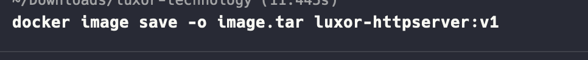
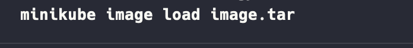

### Luxor Technical Test

## Author: Kurniadi Ilham

Welcome to the Luxor Technical Test repository. This project implements a simple controller designed to watch http-server resources defined through a CustomResourceDefinition (CRD).

Prerequisites
Before you begin, make sure you have the following tools installed on your system, you can refer to the documentation of each tools that needs before:

Python: Ensure that Python is installed on your machine. You can download it from python.org.

Minikube: Minikube is a tool that enables you to run Kubernetes clusters locally. Install Minikube by following the instructions at minikube.sigs.k8s.io/docs/start/.

Docker: Docker is used for containerization. Download and install Docker from docker.com.

### Section 1: Building http-server source code

We need will build the source code that located in src folder with command,

Working directory: src

docker build -t luxor-httpserver:v1

Its because i want to store the image in local, i choose the way to export the image to tar.

Ater that we need to load the image to minikube, so the image can be load.

